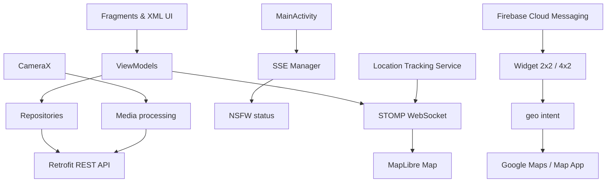

# 📱 PanDo Android

<div align="center">


[](https://developer.android.com/)
[](https://kotlinlang.org/)
[](https://developer.android.com/about/versions/oreo)
[](https://gradle.org/)
[](https://maplibre.org/)

**Ứng dụng chia sẻ khoảnh khắc và vị trí theo thời gian thực với bạn bè**

[Giới Thiệu](#-giới-thiệu) • [Tính Năng](#-tính-năng-chính) • [Cài Đặt](#-cài-đặt-local) • [Kiến Trúc](#️-kiến-trúc) • [Kiểm Thử](#-kiểm-thử)

</div>

---

## 📖 Giới Thiệu

**PanDo** là ứng dụng Android giúp người dùng lưu giữ và chia sẻ những khoảnh khắc đời thực cùng bạn bè. Người dùng có thể xem bạn bè trên bản đồ, đăng ảnh hoặc video tại nơi mình đang ở, trò chuyện realtime và nhận bài đăng mới ngay trên màn hình chính thông qua Widget.

Ứng dụng được xây dựng theo hướng realtime, ưu tiên thao tác nhanh và kết nối giữa **khoảnh khắc — vị trí — bạn bè**:

- **Bản đồ bạn bè** hiển thị vị trí hiện tại và vị trí được chia sẻ theo thời gian thực.
- **Camera tích hợp** cho phép chụp ảnh, quay video và đăng khoảnh khắc ngay trong app.
- **Chat realtime** giúp gửi tin nhắn văn bản, hình ảnh và chia sẻ bài đăng cho bạn bè.
- **Widget bài đăng** đưa khoảnh khắc mới lên màn hình chính, kèm địa điểm check-in và thao tác chỉ đường nhanh.

### 🎯 Điểm Nổi Bật

- **📍 Kết nối vị trí realtime** — Theo dõi vị trí bạn bè trên MapLibre, cập nhật qua STOMP WebSocket và gom nhóm các marker ở gần nhau.
- **📸 Khoảnh khắc tại nơi bạn đang đứng** — Chụp ảnh/quay video tối đa 10 giây, tự xử lý hướng ảnh và nén media trước khi upload.
- **🧭 Chỉ đường một chạm từ Widget** — Khi nhấn vào ảnh/bài đăng hoặc nút chỉ đường trên Widget, hệ thống mở Google Maps hoặc ứng dụng bản đồ mặc định để dẫn từ vị trí hiện tại của người dùng tới tọa độ check-in của bạn bè.
- **💬 Trò chuyện không gián đoạn** — Chat 1-1 realtime, tự kết nối lại khi mạng không ổn định và giữ tin nhắn đang chờ gửi.
- **🔔 Cập nhật ngay cả khi không mở app** — Firebase Cloud Messaging đồng bộ bài đăng mới và cập nhật Widget trên màn hình chính.
- **🔐 Bảo vệ phiên đăng nhập và nội dung** — Token được lưu bằng EncryptedSharedPreferences, tự refresh khi hết hạn và kiểm soát nội dung NSFW theo trạng thái kiểm duyệt/độ tuổi.
- **🌙 Chia sẻ vị trí có kiểm soát** — Người dùng chủ động bật/tắt chia sẻ vị trí; khi chạy nền, Android hiển thị foreground notification rõ ràng.

---

## ✨ Tính Năng Chính

### 📍 Map — Bản Đồ Bạn Bè

- Hiển thị vị trí hiện tại của người dùng và các bạn bè đã chia sẻ vị trí.
- Sử dụng **MapLibre Android SDK** với style bản đồ từ **Amazon Location**.
- Nhận vị trí bạn bè theo thời gian thực thông qua STOMP WebSocket.
- Gom các marker gần nhau thành nhóm để bản đồ dễ quan sát.
- Focus vào bạn bè, nhóm bạn bè hoặc vị trí hiện tại.
- Hiển thị hướng di chuyển/vị trí hiện tại và hỗ trợ mở ứng dụng bản đồ để xem địa điểm.
- Lấy tên khu vực theo tọa độ thông qua Location API của backend.

### 💬 Chat Realtime

- Chat 1-1 giữa hai người dùng.
- Gửi tin nhắn văn bản và hình ảnh.
- Tải danh sách cuộc trò chuyện và lịch sử tin nhắn theo cursor pagination.
- Nhận tin nhắn mới realtime qua STOMP WebSocket.
- Gửi bài đăng trong feed trực tiếp tới cuộc trò chuyện.
- Duy trì kết nối, tự reconnect và xếp hàng các tin nhắn khi WebSocket tạm thời chưa sẵn sàng.

### 📸 Chụp Ảnh / Quay Video

- Chụp ảnh hoặc quay video trực tiếp bằng CameraX.
- Chuyển đổi camera trước/sau, bật/tắt flash và zoom theo preset.
- Video được giới hạn tối đa **10 giây**.
- Xem trước ảnh/video trước khi đăng.
- Thêm caption và tọa độ hiện tại vào bài đăng.
- Chuẩn hóa hướng ảnh theo EXIF.
- Nén ảnh bằng Compressor và nén video bằng Media3 Transformer trước khi upload.

### 🎞️ Feed Dạng Reel

- Feed dọc sử dụng ViewPager2, phù hợp để xem ảnh/video liên tục.
- Phân trang bằng cursor và tự tải trang tiếp theo khi người dùng cuộn gần cuối.
- Video tự phát và lặp lại ở bài đăng đang được chọn.
- Xem địa điểm check-in của bài đăng trên bản đồ.
- Xóa bài đăng của chính người dùng.
- Gửi bài đăng kèm tin nhắn cho bạn bè.
- Nhận kết quả kiểm duyệt NSFW qua SSE và hiển thị cảnh báo theo độ tuổi trong hồ sơ.

### 🧭 Widget & Chỉ Đường Một Chạm

- Có hai kích thước Widget: **2x2** và **4x2**.
- Firebase Cloud Messaging gửi payload bài đăng mới tới app.
- Widget hiển thị ảnh, avatar, tên người đăng, caption và địa điểm check-in.
- Tọa độ check-in được lưu cùng dữ liệu bài đăng để phục vụ thao tác chỉ đường.
- Khi người dùng nhấn thao tác chỉ đường trên ảnh/bài đăng, app tạo `geo:latitude,longitude` intent và mở Google Maps/ứng dụng bản đồ mặc định.
- Ứng dụng bản đồ sử dụng vị trí hiện tại của người dùng làm điểm xuất phát và tọa độ check-in của bạn bè làm điểm đến.
- Bài đăng bị đánh dấu NSFW không ghi đè bài đang hiển thị trên Widget.
- Nút **Trả lời** trên Widget mở thẳng feed để người dùng phản hồi bài đăng.

### 👥 Bạn Bè

- Tìm kiếm người dùng.
- Gửi, hủy, chấp nhận và từ chối lời mời kết bạn.
- Xóa bạn khỏi danh sách bạn bè.
- Hiển thị các nhóm danh sách: bạn bè, lời mời đã gửi và lời mời đã nhận.

### 👤 Hồ Sơ & Quyền Riêng Tư

- Cập nhật tên hiển thị, ngày sinh, giới tính và số điện thoại.
- Chọn ảnh từ thư viện để cập nhật avatar.
- Bật/tắt chế độ chia sẻ vị trí.
- Theo dõi vị trí nền bằng foreground service khi người dùng cho phép.
- Dừng chia sẻ vị trí ngay từ ứng dụng hoặc từ notification của hệ thống.

### 🔐 Xác Thực & An Toàn

- Đăng nhập bằng email và mật khẩu.
- Đăng ký tài khoản bằng email và OTP.
- Quên mật khẩu, xác nhận OTP và đặt lại mật khẩu.
- Access token và refresh token được lưu trữ bằng EncryptedSharedPreferences.
- Tự động refresh token khi API trả về phiên hết hạn.
- Kiểm soát việc hiển thị nội dung NSFW theo trạng thái kiểm duyệt và tuổi người dùng.

---

## 🛠️ Công Nghệ Sử Dụng

| Nhóm | Công nghệ |
| --- | --- |
| Ngôn ngữ/UI | Kotlin, XML Layout, View Binding, Material Components |
| Kiến trúc | MVVM, Repository Pattern, Kotlin Coroutines/Flow |
| Dependency Injection | Hilt, KSP |
| Điều hướng | Android Navigation Component, Safe Args |
| REST API | Retrofit, Gson, OkHttp |
| Realtime | STOMP over WebSocket, OkHttp SSE |
| Camera/Media | CameraX, ExoPlayer, Media3 Transformer, Compressor |
| Bản đồ/Vị trí | MapLibre Android SDK, Amazon Location, Fused Location Provider |
| Hình ảnh | Coil, Glide |
| Firebase | Firebase Cloud Messaging, Firebase Analytics |
| Bảo mật | EncryptedSharedPreferences, JWT Decode, refresh token |
| Widget | Android AppWidget, RemoteViews, PendingIntent |

---

## 🏗️ Kiến Trúc



### Các Lớp Chính

#### 1. Presentation Layer

- `Fragment` quản lý giao diện XML và tương tác người dùng.
- `ViewModel` xử lý state bằng `StateFlow`/`SharedFlow` và giữ logic khi cấu hình màn hình thay đổi.
- `CenterFragment` quản lý ViewPager dọc gồm Map, Camera và Post Reel.

#### 2. Data Layer

- Retrofit API interfaces nằm trong `core/data/api`.
- Repository nằm trong từng feature, chuẩn hóa kết quả qua `BaseRepository` và `DataResult`.
- Các model được tách thành DTO, request, response và UI entity.

#### 3. Realtime & Background Layer

- `SocketConnectionManager` quản lý STOMP WebSocket và tự reconnect.
- `MessagesSocket` xử lý chat; `MapSocket` xử lý vị trí bạn bè.
- `SseManager` nhận sự kiện kiểm duyệt NSFW và tự reconnect với exponential backoff.
- `LocationTrackingService` gửi vị trí nền qua foreground service.
- `PandoFcmService` nhận payload từ Firebase và cập nhật Widget.

#### 4. Session & Security Layer

- `AuthPreferences` lưu access token/refresh token bằng EncryptedSharedPreferences.
- `AuthInterceptor` tự gắn access token vào request.
- `TokenAuthenticator` refresh token khi phiên hết hạn.
- `UserSession` lưu trạng thái người dùng hiện tại bằng Flow.

---

## 📂 Cấu Trúc Thư Mục

```text
app/src/main/java/com/pando/app/
├── core/
│   ├── base/          # BaseFragment, BaseVM, BaseRepository, adapter
│   ├── data/api/      # Retrofit API interfaces
│   ├── data/local/    # EncryptedSharedPreferences
│   ├── extensions/    # Kotlin extensions dùng chung
│   ├── location/      # Location tracking và foreground service
│   ├── network/       # REST, token, WebSocket, SSE
│   ├── service/       # FCM token và FirebaseMessagingService
│   ├── session/       # Session startup và UserSession
│   ├── state/         # UI/connection state
│   └── utils/         # DataResult và utility classes
└── features/
    ├── auth/          # Login, register, OTP, reset password
    ├── home/          # Map, camera, reel, chat, friend, profile, setting
    ├── onboarding/    # Onboarding và quyền ứng dụng
    ├── shared/        # Avatar cache/view model dùng chung
    └── widget/        # Android Widget và FCM post payload
```

---

## 💻 Cài Đặt Local

### Yêu Cầu

- Android Studio hỗ trợ Android Gradle Plugin `9.2.1`.
- JDK `21` cho Gradle.
- Android SDK Platform `37`.
- Thiết bị hoặc emulator Android API `26` trở lên.
- Backend PanDo đang hoạt động.
- Firebase project tương ứng với package `com.jollibee.frontend`.

### Bước 1: Clone Repository

```bash
git clone <repository-url>
cd Frontend
```

### Bước 2: Cấu Hình `local.properties`

Tạo file `local.properties` tại thư mục gốc:

```properties
sdk.dir=/duong-dan/toi/Android/Sdk
AWS_LOCATION_API_KEY=your_amazon_location_api_key
```

File `local.properties` đã được thêm vào `.gitignore` và không được commit.

### Bước 3: Cấu Hình Firebase

Đặt file Firebase vào:

```text
app/google-services.json
```

File này cũng đã được Git ignore. Không commit token, API key riêng tư hoặc file cấu hình Firebase của môi trường cá nhân lên repository công khai.

### Bước 4: Đồng Bộ Và Chạy App

Mở project bằng Android Studio, Sync Gradle rồi chạy trên thiết bị/emulator Android API 26+.

Build bản debug bằng terminal:

```bash
./gradlew assembleDebug
./gradlew installDebug
```

APK được tạo tại:

```text
app/build/outputs/apk/debug/app-debug.apk
```

Trên Windows, dùng `gradlew.bat` thay cho `./gradlew`.

### Backend Mặc Định

Frontend hiện đang sử dụng các endpoint sau:

```text
REST:  https://lockly-api.duckdns.org/api/v2/
STOMP: wss://lockly-api.duckdns.org/ws
SSE:   https://lockly-api.duckdns.org/api/v2/sse/subscribe
```

Các URL nằm trong `ApiConstants`, `SocketConstants` và `SseManager`. Khi đổi môi trường, cần cập nhật các cấu hình này và style map tương ứng.

---

## 🧪 Kiểm Thử

```bash
# Unit test trên JVM
./gradlew test

# Instrumented test, cần thiết bị/emulator đang kết nối
./gradlew connectedAndroidTest

# Android lint
./gradlew lint
```

Các unit test hiện có tập trung vào:

- FIFO queue cho tin nhắn WebSocket.
- Preset và logic zoom của camera.
- Gom nhóm marker, focus marker và tính khoảng cách trên bản đồ.

---

## 🔑 Quyền Android & Quyền Riêng Tư

Ứng dụng có thể yêu cầu:

- Internet và trạng thái mạng.
- Camera và microphone để chụp/quay media.
- Vị trí chính xác/tương đối và vị trí nền.
- Thông báo trên Android 13+.
- Foreground service loại `location`.
- Ghi bộ nhớ ngoài trên Android 9 trở xuống.

Vị trí chỉ được chia sẻ sau khi người dùng bật tính năng và cấp quyền cần thiết. Khi chia sẻ vị trí nền, Android hiển thị notification để người dùng biết dịch vụ đang hoạt động.

---

## 🚧 Trạng Thái Phát Triển

Một số mục giao diện hiện vẫn hiển thị `Coming soon`:

- Chọn media từ gallery trực tiếp trong màn hình Camera.
- Gửi lại OTP.
- Chụp/xóa avatar trực tiếp bằng camera.
- Chặn bạn bè.
- Một số mục mở rộng trong Settings như chia sẻ profile, báo cáo sự cố, appearance và xóa tài khoản.

Chọn ảnh từ thư viện trong màn hình chỉnh sửa avatar đã được hỗ trợ.

---

## 📄 Giấy Phép

Repository hiện chưa kèm file `LICENSE`. Hãy bổ sung giấy phép phù hợp trước khi phân phối mã nguồn công khai.
